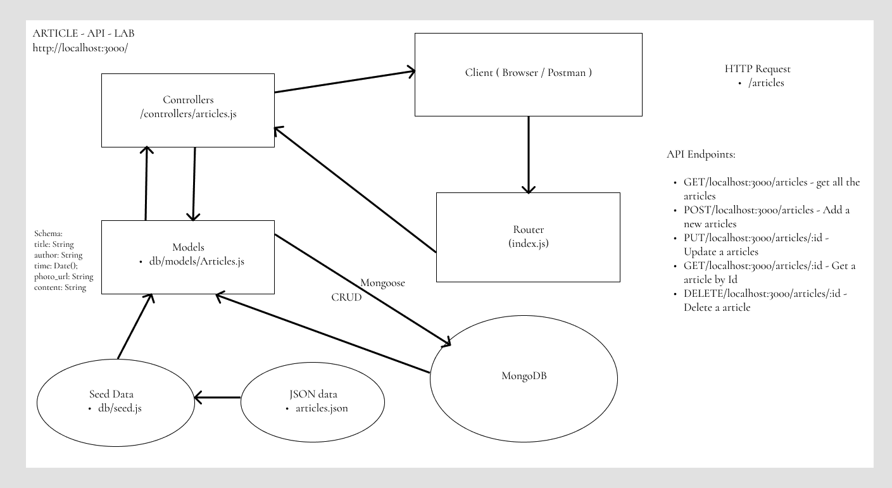

### Description
An open source, blog style website with support for text and images. Free from intrusive advertisements and clunky UIs, (PLACEHOLDER NAME) is the place where you can shout to the masses and be heard.

### Scrum Lead
David Gales

### Developers
| Joey Chang | Landon Spell | Michel Pathinvo | David Gales

### Software Used to Develop the Backend

- JavaScript
- Mongoose
- MongoDB
- Heroku to deploy API

### Flow Chart

### User Stories

### MVP
As a user, I want to be able to see the most read articles in the first page of the desktop or mobile version of the application

As a user, I want to be able to add an article, edit it, and delete it anytime

As a user, I want to be able to illustrate my post with a photo

As a user, I want to be able to add a title and my name to my article

As a user, I want to be able to view an an article when clicked

### Stretch Goals
As a user, I would like to see a carousel that allows users to view different articles on the homepage

As a user, I would like to see the time-stamp of an article when it was last updated

As a user, I would like to see a modal pop-up when I hit the “delete” for an article so I don’t accidentally delete an article without confirmation

As a user, I would like to search for specific articles

### Super Stretch Goals
As a user, I want to be able to have my own account to be able to post blogs without having to type my name/info

As a user, I want to be able to “like” posts and save to a favorites component

As a user, I would like to make a comment onto an article

As a user, I would like to be able to click on an author to see all of their articles